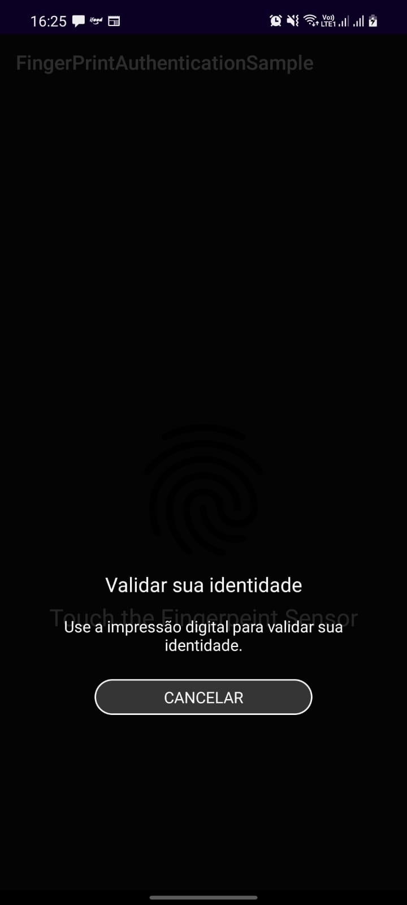

## An Android app sample of how to use FingerPrintManager authentication

* Kotlin
* Android Fingerprint Authentication

### Reference
https://blog.mindorks.com/authentication-using-fingerprint-in-android-tutorial